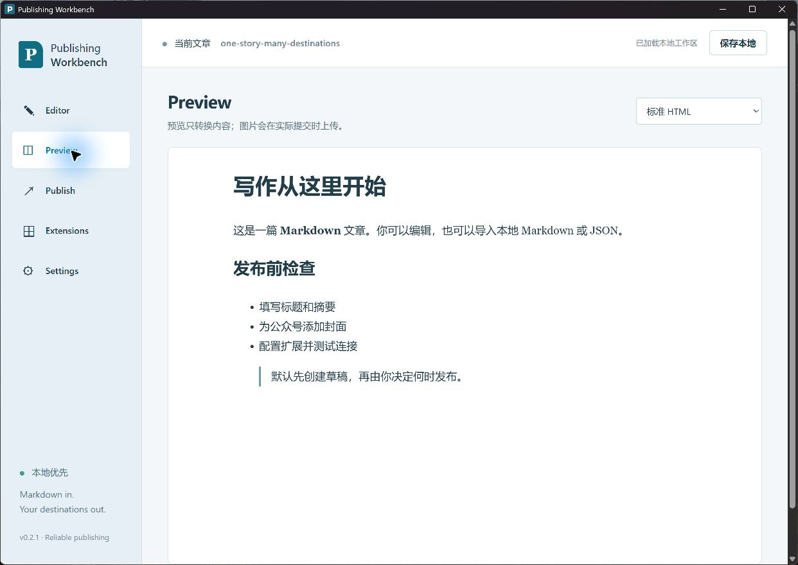
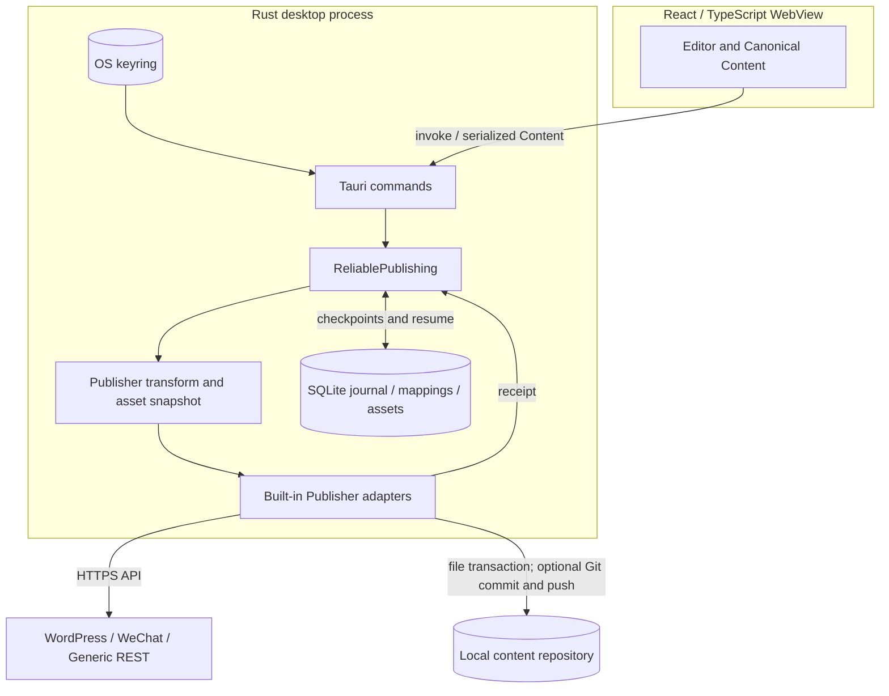

# Publishing Workbench v0.2

轻量、本地优先的 CMS-agnostic 发布工作台。Tauri 2 + Rust + React / TypeScript。编辑或导入 Markdown / MDX / Canonical JSON，由能力声明和配置 schema 驱动扩展 GUI。

**v0.2.1 是可运行的 MVP 预览版。** 提供可靠发布日志、远端映射、SQLite、素材 SHA-256 去重和 Git Content / Digital Garden profile。WordPress、微信公众号和 Generic REST 保留原有适配。没有账号系统、云数据库或生产部署客户端。

v0.2.1 修复 Git 输出中引用式 Markdown / raw HTML 图片的 URL 替换，保留代码示例不变；已有 v0.2.0 标签保留，建议使用最新修正版。



真实桌面预览，使用内置示例数据；不代表远端发布或网站部署成功。[截图来源与重复捕获步骤](docs/README_SCREENSHOTS.md)。

## 本地启动

需要 Node.js 22+、Rust stable、Git。Windows 需要 Microsoft C++ Build Tools 和 WebView2 Runtime；macOS/Linux 按 [Tauri 官方 prerequisites](https://v2.tauri.app/start/prerequisites/) 安装平台依赖。

```sh
npm ci
npm run tauri -- dev
```

`npm run dev` 仅提供浏览器编辑/预览演示，实际配置、SQLite 和发布在桌面 Rust 进程中执行。

```sh
cargo fmt --manifest-path src-tauri/Cargo.toml --check
cargo clippy --manifest-path src-tauri/Cargo.toml --all-targets -- -D warnings
cargo test --manifest-path src-tauri/Cargo.toml
npm test
npm run lint
npm run build
npm run tauri -- build
```

Windows Release 提供 portable EXE / ZIP，解压运行 EXE；无安装器、自动升级或签名。Linux/macOS 源码可构建，但本次仅验证 Windows。`bundle.active=false` 保留轻量单程序输出，EXE 位于 `src-tauri/target/release/`。

## 使用

1. 在 Editor 编辑，或导入 MD / MDX / JSON。新建文章生成 UUID；修改标题/slug 保留 article_id。导出 JSON 保留 ID。桌面「从本地路径导入」用规范源路径复用 ID；浏览器文件上传的 Markdown 每次视为新文章。重复发布应使用原工作台文章或导出的 JSON。
2. 在 Extensions 保存配置并测试连接。Git Content 可自动探测附近有 `engine.lock.json` 与内容目录的 Digital Garden 仓库，建议需手动保存；不猜测不存在的路径。
3. 在 Preview 检查内容；本地图片由 Rust 转成 data URL，不上传。MDX 作为文本保存，预览不执行 JSX。
4. 在 Publish 选择目标，默认草稿。页面显示 create/update、当前步骤、素材复用/上传和结果。直接 publish/delete 需要在 GUI 确认。
5. 失败任务在 Publish History 使用 Retry / Resume。任务保留原内容、素材快照和 job_id；调整编辑器不会修改正在恢复的任务。修正密钥后可以重试；其他配置必须保持原值。

Settings 设置相对图片的根目录；未设置时，从路径导入的文章使用源文件目录。正文可保留在 MD/MDX 文件中，不需要把数据库作为唯一内容来源。工作台保存文章快照，导出 JSON 不改源文件。

## 架构与目录

<!-- architecture:overview:start -->



<!-- architecture:overview:end -->

桌面 `dispatch` 先进入 `ReliablePublishing::start`，后者选择 Publisher 并调用 transform；不是前端先完成平台转换。内置 Registry 是 Rust trait 分派，不是独立插件进程。SQLite 保存任务、步骤、映射和素材，凭据由桌面端从 OS keyring 读取。

失败后 Retry 使用原任务快照。未知远端结果进入 `needs_reconciliation`，不能保证任意外部 API 恰好执行一次；Git Content 使用文件事务核对恢复。启动把遗留 running 任务标为 interrupted。工作台不执行网站生产部署；可选 Git push 后的 CI 属于目标仓库。现有截图仅证明 v0.2.1 原生预览，后续 CMS 代码不因此被宣称已发布。

[Source evidence and diagram verification](docs/architecture/README.md).

```text
src-tauri/
  content/                    # Canonical model / stable article ID
  core/                       # HTTP/error/config helpers
  transform/                  # Markdown / sanitized HTML / asset loading
  storage/                    # SQLite migration + journal + asset registry
  publishing/reliable.rs      # dispatch / checkpoints / mapping / resume
  extensions/
    wordpress/ wechat/ generic_rest/ git_content/
  desktop.rs                  # Tauri commands, secure credentials, local preview
src/
  editor/ preview/ publishing/ extensions/ settings/
docs/                         # reliability details, validation report
examples/                     # non-secret config and content
```

Content Core 包含 article_id、title、slug、summary、body、cover、authors、tags、metadata，额外保留 format 和 source_path。平台规则都在 extension 中。

## Extension API

Rust `Publisher` trait 保留 `manifest / capabilities / connect / test_connection / transform / preview / create_draft / publish / update / execute`，增加 `target_identity / asset_variant / resolve_asset_source / upload_asset / recover / safe_remote_retry`。`Registry` 注册内置扩展；无需动态插件框架。GUI 只读取 manifest 的 capabilities 和 schema。

统一入口为 `ReliablePublishing::start(extension, action, content, config, asset_base)`；恢复入口为 `retry(job_id, config)`。桌面发布全部经过该入口。旧 `Registry::dispatch` 仅是适配器级兼容 API，不提供日志和幂等保障。

`Prepared` 包含转换内容、HTML、job_id、remote_id、素材回执与 assets_processed。`Receipt` 返回 id / url / status / revision。不支持的操作返回 `unsupported`。Capabilities 为可用能力名称列表，缺席表示 false。

| Extension               | draft | publish | update | delete | assets | 格式与补充能力                         |
| ----------------------- | ----- | ------- | ------ | ------ | ------ | -------------------------------------- |
| WordPress               | ✓     | ✓       | ✓      | —      | ✓      | html, tags                             |
| WeChat Official Account | ✓     | —       | ✓      | —      | ✓      | html                                   |
| Generic REST            | ✓     | ✓       | ✓*     | —      | —      | html, markdown, tags                   |
| Git Content             | ✓     | ✓       | ✓      | ✓      | ✓      | markdown, mdx, tags, revision, preview |

全部 schedule=false。Generic update 需要配置 update_endpoint，否则明确停止，不重新创建。

## Reliable Publishing

稳定目标 ID 使用扩展 ID + 非密钥目标身份哈希（WP URL/user、微信 AppID、REST endpoint、Git root/profile）。不同目标分别映射。修改密钥不会成为新目标。

```text
running → success
        → failed → retry(same job) → running
        → needs_reconciliation → verify remote receipt → resume
process restart: running → interrupted → resume
safe pre-remote failure → cancelled
```

每个任务持久化六步：transform → upload assets → upload cover → create/update remote → save mapping → complete。SQLite 将 job 和 steps 原子保存。已有 remote_id 时用 update；相同内容/动作/扩展转换版本/非密钥配置/素材哈希跳过远端写入。成功回执先持久化，再保存 mapping。失败、断电和未知远端状态不能被当作不存在的文章。

超时/5xx/回执缺失可能代表服务已创建文章，不能保证所有外部服务恰好执行一次。此时阻止盲目 create，WP 按 slug + job marker 查找回执；Git 通过持久化文件事务恢复；REST 仅在用户确认服务器实现 Idempotency-Key 后自动重发；微信需要人工核对 media_id。所有 REST 任务发送固定 Idempotency-Key 和 X-Article-Id，声明幂等必须由服务器实际兑现。收到无 ID 的 204 创建保留空映射；再次修改时停止，避免重复创建。

素材以 SHA-256 + target_id + variant 保存。WP body/cover 共享素材，微信正文 URL 与永久封面 media_id 分开，Git draft/private/published 隔离。失败后保留已成功素材与快照，恢复不重复上传。未知素材回执先核对。孤立素材在 GUI 报告，不自动危险删除。缓存和任务保存文章/图片，备份时一起保护。

详细状态、schema 与风险见 [docs/reliability.md](docs/reliability.md)。

## WordPress

使用官方 `/wp-json/wp/v2` REST API 和 Application Password。测试 `/users/me`；transform Markdown→HTML；素材 POST `/media` 后替换 URL；按标签名称查询/创建 tags，分类通过 `metadata.categories` 数字 ID 数组映射；第一次 POST `/posts`，已有映射 POST `/posts/{id}`。createDraft/publish 决定 draft/publish 状态，显式 update 保留当前状态。记录 modified_gmt；回执不确定时查找 HTML 中 workbench job marker。避免同时用其他工具修改同篇文章，v0.2 尚未对 WP 提供 If-Match 强一致锁。

## WeChat Official Account

配置 AppID/AppSecret，要求账号具备素材/草稿权限，并配置 API IP 白名单。使用官方 stable_token；正文图片 `media/uploadimg`，封面永久素材 `material/add_material`；替换图片并转换微信兼容 HTML；首次 `draft/add`，映射后 `draft/update` 更新第一个图文。保存 media_id，始终进入草稿箱，publish/delete/schedule unsupported。不提供群发。

## Generic REST

配置 endpoint、POST/PUT/PATCH、Headers、Bearer Token、JSON template，可选 update_endpoint（包含 `{{remote_id}}`）和 update_method。HEAD 用于连接测试。变量支持 article_id、job_id、remote_id、intent、title、slug、summary、body、html、cover、authors、tags、metadata、action；完整字符串变量保留 JSON 类型，内嵌变量转字符串。响应读取 id / url / ETag；update 204 保留原 ID。正文图片必须已有远程 URL，未知 REST 服务没有通用素材上传协议。

```json
{
  "article": "{{article_id}}",
  "title": "{{title}}",
  "body": "{{html}}",
  "tags": "{{tags}}",
  "intent": "{{intent}}"
}
```

## Git Content / Digital Garden Engine

通用 Git 扩展支持 repository_path、profile、content_kind、published posts/projects/library、draft/private/assets paths、auto_commit、auto_push、commit_template。默认均不自动 commit/push。文件写入前保存 before/after 事务快照到 Git 元数据目录；检查 working tree/index，不覆盖未提交用户修改、slug 冲突或有变化的映射文件。提交只包含该任务路径。允许更新工作台上次留下且内容哈希完全一致的未提交文件。事务恢复检查每个文件仍等于 before/after。Git 失败显示步骤与可操作错误；无 reset/force push。Delete 只删除已验证归属的映射文章，素材保留供核对。

| Canonical kind | Published                  | Draft                   | Private                  |
| -------------- | -------------------------- | ----------------------- | ------------------------ |
| Writing        | content/published/posts    | content/drafts/posts    | content/private/posts    |
| Project        | content/published/projects | content/drafts/projects | content/private/projects |
| Library        | content/published/library  | content/drafts/library  | content/private/library  |

DGE profile 使用引擎规定的固定目录，错误配置不会写入 published。Draft 操作优先级最高；metadata.visibility=private 支持私有路径。格式字段控制 .md/.mdx。frontmatter 输出 title/slug/date/status/description/tags，Writing maturity；Project name/year/projectStatus/category/featured/priority/stack/links；Library kind/readingStatus。值可由 metadata 提供，默认值在适配器中定义，未知额外 metadata 不输出。frontmatter 不加入引擎禁止的 article_id；归属 UUID 用正文 HTML comment 保存。素材写到对应 status/assets，链接使用 /garden-assets/内容哈希.ext。

Generic Markdown profile 可配置其他目录，输出 article_id，仍要求 draft/private/published 互不重叠。此 profile 不是任意静态站点生成器的完整 frontmatter 适配。

## styayur.co.uk 验证与部署边界

已通过本地 engine.lock / site.config / Git remote 确认内容仓库，生成并更新 `content/drafts/posts/workbench-v02-safe-draft.mdx`，没有 commit/push。锁定引擎运行 validation、staging、public build 和 artifact audit；验证报告见 [docs/validation-v0.2.md](docs/validation-v0.2.md)。

允许的生产流程是：Workbench → Git Content → 内容仓库 → 可选 commit/push → 仓库现有 GitHub Actions → validation → staging → build → artifact audit → Cloudflare Pages → styayur.co.uk。工作台没有 Wrangler 调用，不绕过 publication gate。测试草稿可由用户检查或删除；它不在本次应用 GitHub Release 中。

## 本地数据与安全

SQLite 位于系统 app-data `dev.styayur.publishing-workbench/workbench.sqlite3`，配套 `.lock`、WAL 和素材缓存。初次启动导入 v0.1 workspace.json，保留原文件；旧历史保留但不会猜测 remote mapping。PRAGMA user_version=1，事务 migration，拒绝未知高版本。`WORKBENCH_DATA_DIR` 可设置隔离的本地数据目录，用于测试/便携配置；凭据仍在系统凭据库，不随数据库迁移。

密钥、AppSecret、Token、Headers 保存在 OS keyring，不写 SQLite/Git，不在错误中输出完整凭据。credential namespace 为 publishing-workbench。配置示例是占位符；本应用不自动读取 .env 中的凭据。网络请求只允许 HTTPS 或 loopback HTTP，不跟随重定向，有限超时/响应大小。私有正文和图片快照在本机磁盘未额外加密；Git profile 不执行 MDX，但站点构建可能执行其中代码，应使用可信内容。

## License

按 [Stya Yur LICENSE_POLICY](https://github.com/styayur/styayur/blob/main/LICENSE_POLICY.md) 的 Applications 分类，第一方应用源代码（包括内置 publishing adapters 和测试）采用 **AGPL-3.0-only**，见 [LICENSE](LICENSE)。本项目不是独立可复用引擎或协议运行时，因此未把模块人为拆成不同软件许可证。README、docs 和原创示例文字采用 **CC BY 4.0**，见 [LICENSE-CONTENT](LICENSE-CONTENT)。代码示例仍为 AGPL。第三方依赖保留原许可证，见 [THIRD_PARTY.md](THIRD_PARTY.md) 和 [NOTICE](NOTICE)。Digital Garden Engine 仅作为外部兼容目标，不复制或重新许可它的代码。
